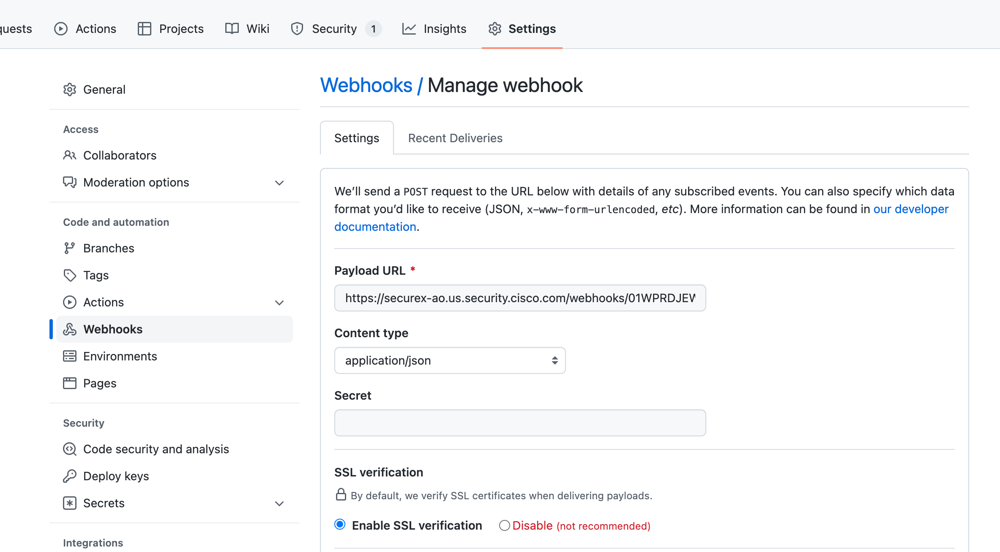
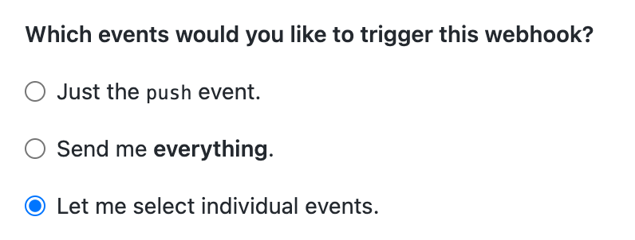
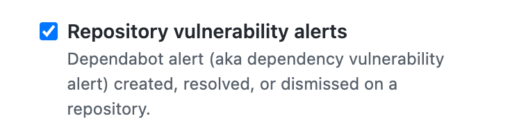

# Workflow to Trigger an Automated Threat Hunt in SecureX from your CI/CD pipeline 

This workflow can be triggered via a Vulnerability Alert Webhook from GitHub. It will then check whether the found vulnerability was actually exploited in your environment using the Cisco Kenna VI+ and Cisco SecureX APIs. This could happen when a new CVE is discovered and your production code is using that specific library. Obviously, you want to patch the application as soon as possible, but it could be that someone was already exploiting this vulnerability before the disclosure. This is a so-called “zero-day exploit”. 

The triggered SecureX Orchestration workflow then checks all of the integrated SecureX modules for a sighting of the malware that can exploit our new vulnerability. If so, it will generate a notification via Webex and create an Incident in ServiceNow. Obviously, it is very easy to change this to whatever tool you might be using. Based on this the security incident response team needs to get in action.

> **Note:** Please test this properly before implementing in a production environment. This is a sample workflow!

> **Note:** Please also see my GitHub action for the [Cisco Kenna VI+ API](https://github.com/chrivand/action-kenna-cve-exploits-js)

## Required Targets
- CTR_For_Access_Token (default)
- CTR_API (default)
- Webex Teams (see instructions)
- Kenna Security VI+ (see instructions)
- ServiceNow (see instructions)

## Required Account Keys
- CTR_Credentials (default)
- Webex Teams Token (see instructions)
- Kenna Security VI+ (see instructions)
- ServiceNow (see instructions)

## Required Atomic Workflows
- Threat Response - Generate Access Token (System Atomic, no import needed)
- Threat Response - Enrich Observable (System Atomic, no import needed)
- Service Now - Create Incident (System Atomic, no import needed)
- Webex Teams - Post Message to Room (System Atomic, no import needed)

## Setup instructions

### Set up SecureX Webhook Receiver
#### Login to SecureX Orchestration
1. Browse to your SecureX orchestration instance. This wille be a different URL depending on the region your account is in: 

* US: https://securex-ao.us.security.cisco.com/orch-ui/workflows/
* EU: https://securex-ao.eu.security.cisco.com/orch-ui/workflows/
* APJC: https://securex-ao.apjc.security.cisco.com/orch-ui/workflows/

#### Creating a Webhook
When you create a webhook, you'll be given an HTTP endpoint you can push events to. You can have a single webhook trigger a single workflow or a single webhook can trigger multiple workflows.

1. Under the **Events & Webhooks** section, click the **Webhooks** tab.
2. Click on the **New Webhook** button.
3. Give the webhook a meaningful **Display Name** and then validate the **Request Content Type**: `application/json`
4. The webhook details will populate after the new webhook is created, so click the **Submit** button.
5. Back on the webhooks page, click on the webhook you just created to view its details.
6. Make note of the **Webhook URL**. This is the URL the source of the webhooks will push events to from GitHub.

#### Adding a Webhook to a Workflow
Once you've created a webhook using the steps above, you need to do two things:
1. Create an event that will be triggered when the webhook receives data.
2. Add the event to your workflow as a trigger.

> **Note:** Once the workflow is configured with a trigger, you can use the trigger's output variables in your workflow. This has already been configured.

### Set up GitHub Webhook Trigger
1. In your GitHub repository select **Settings > Webhooks**. Copy paste the Webhook URL you created in the previous steps:

2. Make sure the **SSL verification** is selected and also the **Content type** is set to `JSON`.

3. Next select **Let me select individual events.**:

4. Finally choose the events that you want to trigger on. Currently this workflow works with **Dependabot** alerts:

### Import Workflow

1. In the left pane menu, select **Workflows**. Click on **IMPORT** to import the workflow:

2. Click on **Browse** and copy paste the content of the [github-kenna-securex-workflow.json](https://raw.githubusercontent.com/chrivand/github-kenna-securex-workflow/main/github-kenna-securex-workflow.json) file inside of the text window. Select **IMPORT AS A NEW WORKFLOW (CLONE)** and click on **IMPORT**.

3. Make sure your API keys are all correct in the HTTP targets. We are using the Cisco SecureX (default configured), [Cisco Webex](https://developer.webex.com/docs/api/getting-started), [Cisco Kenna Security VI+ API](https://apidocs.kennasecurity.com/reference/show-malware-hashes-1) and [ServiceNow](https://docs.servicenow.com/bundle/paris-application-development/page/build/applications/concept/api-rest.html) APIs.

> **Note:** Please retrieve your Webex key from: [https://developer.webex.com/docs/api/getting-started](https://developer.webex.com/docs/api/getting-started). Please be aware that the personal token from the getting started page only works for 12 hours. Please follow these steps to request a "bot" token: https://developer.webex.com/docs/integrations.

## Notes

* Please test this properly before implementing in a production environment. This is a sample workflow!

## Author(s)

* Christopher van der Made (Cisco)
